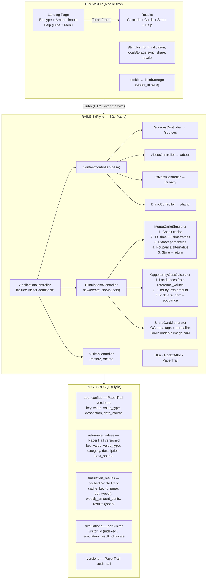

# You-Bet — Architecture

Technical architecture for the MVP. For motivation and product spec, see [PROPOSAL.md](PROPOSAL.md).

---

## Stack

| Layer | Choice | Rationale |
|---|---|---|
| **Backend** | Rails 8, Ruby 3.3+ | Convention-over-configuration accelerates solo dev. Hotwire ships built-in — no separate frontend build. ([Rails 8 release notes](https://rubyonrails.org/2024/11/7/rails-8-no-paas-required)) |
| **Database** | PostgreSQL (Fly.io managed) | JSONB for simulation results, array columns for bet_types, `pg_stat_statements` for query monitoring. Industry standard for OLTP. ([PostgreSQL docs](https://www.postgresql.org/docs/current/datatype-json.html)) |
| **Frontend** | Rails views + Hotwire (Turbo Frames + Stimulus) | Server-rendered HTML, no SPA overhead. Turbo Frames give partial page updates without client-side state management. ([Hotwire docs](https://hotwired.dev/)) |
| **Audit trail** | PaperTrail | Every data change tracked with `whodunnit`, `object_changes`, timestamps. Required for data traceability — every number in `reference_values` has a `data_source` citation. ([PaperTrail gem](https://github.com/paper-trail-gem/paper_trail)) |
| **Rate limiting** | Rack::Attack | Rack middleware for throttling and fail2ban. Used by GitLab, Discourse, Mastodon in production. Runs before the Rails stack — blocks abuse before it hits the app. ([Rack::Attack gem](https://github.com/rack/rack-attack)) |
| **i18n** | Rails built-in I18n | PT-BR primary, EN scaffold ready. Rails I18n is mature and avoids external dependencies. ([Rails I18n guide](https://guides.rubyonrails.org/i18n.html)) |
| **Hosting** | Fly.io — São Paulo region (`gru`) | Only PaaS with a data center in Brazil. Sub-50ms latency to São Paulo. Managed Postgres included. ([Fly.io regions](https://fly.io/docs/reference/regions/)) |
| **CI** | GitHub Actions | Free for public repos. Native GitHub integration for PR checks. ([GitHub Actions docs](https://docs.github.com/en/actions)) |

---

## System Diagram



---

## Database Schema

```ruby
# --- App configs (system-level constants — Monte Carlo params, rates, retention) ---

create_table :app_configs do |t|
  t.string :key, null: false, index: { unique: true }
  t.string :value, null: false
  t.string :value_type, null: false, default: "string"  # string, integer, float
  t.string :description
  t.string :data_source                                  # where this number comes from
  t.timestamps
end

# --- Reference values (externally-sourced cited data — prices, house edges) ---

create_table :reference_values do |t|
  t.string :key, null: false, index: { unique: true }
  t.string :value, null: false
  t.string :value_type, null: false, default: "string"
  t.string :category, null: false, index: true           # comparison, bet_type
  t.string :description
  t.string :data_source                                  # citation for this value
  t.timestamps
end

# --- Cached Monte Carlo results ---

create_table :simulation_results do |t|
  t.string :cache_key, null: false, index: { unique: true }
  t.string :bet_types, array: true, default: []
  t.integer :weekly_amount_cents, null: false
  t.jsonb :results, default: {}  # all 5 timeframes
  t.timestamps
end

# --- Per-visitor simulation records ---

create_table :simulations do |t|
  t.string :visitor_id, null: false, index: true
  t.references :simulation_result, null: false, foreign_key: true
  t.string :locale, default: "pt-BR"
  t.timestamps
end

# --- PaperTrail versions (auto-generated) ---
```

### Results JSONB Structure

```json
{
  "4_weeks": {
    "expected_loss_cents": 6000,
    "percentiles": { "p5": -18000, "p25": -10000, "p50": -6000, "p75": -2000, "p95": 5000 },
    "profit_percentage": 38.2,
    "poupanca_alternative_cents": 1740
  },
  "26_weeks": { "..." },
  "52_weeks": { "..." },
  "104_weeks": { "..." },
  "260_weeks": { "..." }
}
```

---

## Reference Data Infrastructure

Two tables — `app_configs` for system-level constants, `reference_values` for externally-sourced cited data (prices, house edges). Both have `data_source` for traceability. Both PaperTrail-versioned.

**Why two tables?** `app_configs` are internal decisions (how many simulations to run, retention policy). `reference_values` are external facts that change independently and need citations (pizza prices, house edges). Different update cadence, different ownership. ([Separation of Concerns — Martin Fowler](https://martinfowler.com/bliki/SeparationOfConcerns.html))

### `app_configs`

```
monte_carlo_sims       = 1000     | source: "internal"
poupanca_monthly_rate  = 0.0067   | source: "BCB Selic/TR"
minimum_wage_cents     = 162100   | source: "Decreto federal 2026"
data_retention_days    = 180      | source: "internal (LGPD policy)"
```

### `reference_values` (category: `comparison`)

```
pizza_price_cents        = 4000     | source: "iFood avg delivery, Jun 2026"
iphone_price_cents       = 550000   | source: "Apple BR store, Jun 2026"
smartphone_price_cents   = 90000    | source: "Magazalu Moto G, Jun 2026"
cesta_basica_cents       = 80000    | source: "DIEESE Jun 2026"
netflix_spotify_cents    = 5500     | source: "Official pricing, Jun 2026"
motorcycle_price_cents   = 1000000  | source: "OLX Honda CG 160 avg, Jun 2026"
rent_monthly_cents       = 120000   | source: "FipeZap national avg, Jun 2026"
flight_price_cents       = 80000    | source: "Google Flights domestic avg"
fridge_price_cents       = 200000   | source: "Americanas avg, Jun 2026"
course_price_cents       = 250000   | source: "SENAC avg tech course"
```

### `reference_values` (category: `bet_type`)

```
sports_singles.house_edge  = 0.06   | source: "Standard bookmaker vigorish"
accumulator_3.house_edge   = 0.15   | source: "Compounding 5% per-leg margin"
accumulator_5.house_edge   = 0.23   | source: "Compounding 5% per-leg margin"
slots_tigrinho.house_edge  = 0.05   | source: "PG Soft RTP adjusted for unregulated"
crash_aviator.house_edge   = 0.04   | source: "Operator-configurable, conservative"
lottery.house_edge         = 0.54   | source: "Caixa prize pool rules"
roulette.house_edge        = 0.0526 | source: "American: 38 pockets, pays as 36"
```

### Access Pattern

```ruby
AppConfig.get("monte_carlo_sims")                       # => 1000
ReferenceValue.get("comparison.pizza_price_cents")       # => 4000
ReferenceValue.get("bet_type.sports_singles.house_edge") # => 0.06
```

### PaperTrail

```ruby
class ReferenceValue < ApplicationRecord
  has_paper_trail
end

class AppConfig < ApplicationRecord
  has_paper_trail
end
```

Every change records: what changed, when, who, and the `data_source` update. This creates a full audit trail — if a price changes, we know what it was, when it changed, and which source justified the update.

### Future "Modifier" Feature

Users get range sliders for house edge (conservative/aggressive). Add `_min`/`_max` keys per reference value. No migration needed.

---

## Simulation Engine

### Server-Side Monte Carlo with Turbo

Form submission → Rails runs `MonteCarloSimulator` → Turbo Frame swaps in results. All 5 timeframes calculated in one pass.

**Why server-side** (not client-side JS):

| Reason | Detail |
|---|---|
| Aggregate data | Collect anonymized simulation data for impact stats ("this week, 5,000 people simulated R$12M in losses") |
| House edge protection | Logic stays server-side — not inspectable or manipulable via browser dev tools |
| Shareable permalinks | Server-generated results enable OG meta tags for rich link previews |
| Simpler frontend | No client-side state management, just Stimulus for UI interactions |
| Turbo UX | Hotwire gives smooth no-reload experience without SPA complexity ([Hotwire handbook](https://hotwired.dev/)) |

### Calculation Model

**Layer 1 — Expected Value:**
```
expected_loss = total_wagered × house_edge
```

**Layer 2 — Monte Carlo (1,000 simulations):**
- Simulate each week's bets by type, amount, and house edge
- Track cumulative P&L per simulation
- Extract percentiles: P5, P25, P50, P75, P95

**Why Monte Carlo over closed-form?** Accumulators have non-normal distributions (many small losses, rare large wins). Monte Carlo captures this skew and lets us show realistic percentile ranges. Closed-form expected value is Layer 1 — Monte Carlo adds the distribution story. ([Monte Carlo methods in finance — Glasserman, 2003](https://link.springer.com/book/10.1007/978-0-387-21617-1))

**Layer 3 — Poupança comparison:**
```
monthly_deposit = weekly_amount × 4.33
balance compounds at poupança rate monthly
```

### Caching

Same inputs → statistically equivalent results. Cache by composite key:

```
cache_key = "#{bet_types.sort.join(',')}:#{weekly_amount_cents}"
```

- Cache miss → run `MonteCarloSimulator`, store in `simulation_results`
- Cache hit → reuse results, create new `simulations` record for aggregate tracking
- Popular combos (R$50/week accumulators) computed once, served many times

---

## Anonymous Sessions

**Why anonymous?** No login = no friction = more simulations = more impact. The app's goal is reach, not user profiles. UUID-based tracking gives us aggregate data without PII. ([Privacy by Design — Cavoukian, 2011](https://iapp.org/resources/article/privacy-by-design-the-7-foundational-principles/))

UUID in cookie + localStorage (dual-storage):

1. First visit → generate UUID, set `cookies.signed.permanent[:visitor_id]`
2. JS syncs to localStorage as fallback
3. If cookie cleared but localStorage has it → restore via API
4. All simulations linked by `visitor_id`
5. "Apagar meus dados" → destroys all records + clears cookie

### LGPD Compliance

Reference: [LGPD — Lei nº 13.709/2018](https://www.planalto.gov.br/ccivil_03/_ato2015-2018/2018/lei/l13709.htm)

- Privacy notice in footer + dedicated `/privacy` page
- What we collect: anonymous UUID + simulation data. Why: save results + aggregate stats + security. Retention: 180 days. Deletion: button.
- Cookies for security (rate limiting, abuse prevention) — legitimate interest under LGPD Art. 7(IX)
- Request logs (IP, path, status) kept separately for security, NOT tied to visitor_id
- Data is anonymized: visitor_id is a random UUID with no link to identity

---

## Security & Logging

This app will be targeted. Betting is a R$30 bi/month industry in Brazil. Plan accordingly.

### OWASP Top 10 (2025) Coverage

Reference: [OWASP Top 10:2025](https://owasp.org/Top10/2025/)

| OWASP Risk | Our Exposure | Mitigation |
|---|---|---|
| **A01 — Broken Access Control** | Low. No auth, no admin panel. Only write: simulation creation. | UUID permalinks (not enumerable), no elevation path |
| **A02 — Security Misconfiguration** | Medium. Open source = config is public. | ENV vars for all sensitive values, CSP headers, secure defaults |
| **A03 — Supply Chain Failures** | Medium. Ruby gems, GitHub Actions. | `Gemfile.lock` pinned, `bundler-audit` in CI, Dependabot enabled |
| **A04 — Cryptographic Failures** | Low. No passwords, no PII. | TLS via Fly.io, signed cookies for visitor_id |
| **A05 — Injection** | Medium. User input: bet types + amount. | Rails parameterized queries, strong params, input validation at boundary |
| **A06 — Insecure Design** | Low. Simple CRUD with read-heavy public data. | Threat model in this section, rate limiting from day 1 |
| **A07 — Authentication Failures** | N/A. No authentication. | — |
| **A08 — Software/Data Integrity** | Low. PaperTrail on all reference data. | Audit trail, CI pipeline, no user-uploaded content |
| **A09 — Logging & Alerting Failures** | Medium. Solo dev, no oncall. | Structured JSON logs, Fly.io metrics, rate limit event logging |
| **A10 — Mishandling Exceptions** | Medium. Monte Carlo edge cases (zero amount, extreme values). | Input validation, rescue handlers, error boundary in Turbo |

### Rate Limiting (Rack::Attack)

**Why Rack::Attack?** Rack middleware that runs before the Rails stack — blocks abuse before it hits controllers or the database. Used in production by GitLab, Discourse, and Mastodon. ([Rack::Attack gem](https://github.com/rack/rack-attack))

**Open source safety:** Throttle rules (paths, limits, periods) are safe to expose — attackers can discover limits through testing anyway. Fail2ban regex patterns and blocklists go in ENV vars to prevent evasion crafting. This follows GitLab and Mastodon's approach. ([OWASP API Security — API4:2023](https://owasp.org/API-Security/editions/2023/en/0xa4-unrestricted-resource-consumption/))

```ruby
# Throttle simulation creation
Rack::Attack.throttle("simulations/ip",
  limit: ENV.fetch("RATE_LIMIT_SIMULATIONS", 10).to_i,
  period: 60
) do |req|
  req.ip if req.path == "/simulations" && req.post?
end

# Throttle general requests
Rack::Attack.throttle("requests/ip",
  limit: ENV.fetch("RATE_LIMIT_REQUESTS", 60).to_i,
  period: 60
) do |req|
  req.ip
end

# Fail2ban — patterns in ENV, not in source code
Rack::Attack.blocklist("fail2ban") do |req|
  Rack::Attack::Fail2Ban.filter("suspicious-#{req.ip}",
    maxretry: ENV.fetch("FAIL2BAN_MAXRETRY", 3).to_i,
    findtime: ENV.fetch("FAIL2BAN_FINDTIME", 600).to_i,
    bantime: ENV.fetch("FAIL2BAN_BANTIME", 3600).to_i
  ) do
    pattern = ENV.fetch("FAIL2BAN_PATTERN", "")
    pattern.present? && req.query_string =~ /#{pattern}/i
  end
end
```

### Logging Strategy

| What We Log | Purpose | Retention |
|---|---|---|
| Request logs (IP, path, status, duration) | Security — abuse detection | 30 days |
| Rate limit hits (IP, throttle name) | Security — attack detection | 30 days |
| Blocked requests (IP, pattern) | Security — forensics | 90 days |
| Reference data changes (PaperTrail) | Audit trail — data integrity | Permanent |
| Simulation volume (aggregate hourly) | Monitoring — bot detection | 90 days |

**Data separation:** Security logs (IP-based) and user data (visitor_id-based) are separate streams. They don't cross. Security logs exist for legitimate interest (LGPD Art. 7(IX)). User data exists for functionality.

### Infrastructure

| Tool | Purpose | Rationale |
|---|---|---|
| **Rack::Attack** | Rate limiting + fail2ban | Runs at Rack level, before Rails. Day 1. |
| **Rails.logger** | Structured JSON in production | Machine-parseable for Fly.io log drain |
| **Fly.io metrics** | Request monitoring | Built-in, no extra dependency |
| **PaperTrail** | Reference data audit trail | Every number change tracked with source |
| **bundler-audit** | Gem vulnerability scanning | CI step, catches known CVEs in dependencies |
| **Sentry** | Exception tracking (nice-to-have) | Free tier, adds error alerting |

---

## i18n

```
config/locales/
  pt-BR.yml    # Primary
  en.yml       # Secondary
```

Locale detection: browser `Accept-Language` header, with manual toggle in UI.

---

## Open Source

| Item | Choice |
|---|---|
| License | MIT |
| Files day 1 | LICENSE, README.md, .github/workflows/ci.yml, .env.example |
| Branch strategy | `main` only (solo dev sprint) |
| CI | GitHub Actions — Rails tests + Postgres service + bundler-audit |

### Environment Variables

All sensitive or tuneable values live in ENV, not in source code. `.env.example` documents every variable with safe defaults.

```
# Rate limiting (safe defaults, tuneable per environment)
RATE_LIMIT_SIMULATIONS=10
RATE_LIMIT_REQUESTS=60
FAIL2BAN_MAXRETRY=3
FAIL2BAN_FINDTIME=600
FAIL2BAN_BANTIME=3600
FAIL2BAN_PATTERN=              # regex — intentionally not in source

# Rails
SECRET_KEY_BASE=               # required in production
DATABASE_URL=                  # Fly.io sets this automatically

# Optional
SENTRY_DSN=                    # exception tracking
```
