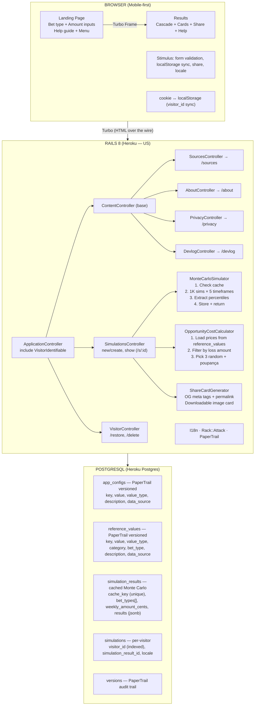

# You-Bet — Architecture

Technical architecture for the MVP. For motivation and product spec, see [PROPOSAL.md](PROPOSAL.md).

---

## Stack

| Layer | Choice | Rationale |
|---|---|---|
| **Backend** | Rails 8, Ruby 4.0 | Convention-over-configuration accelerates solo dev. Hotwire ships built-in — no separate frontend build. ([Rails 8 release notes](https://rubyonrails.org/2024/11/7/rails-8-no-paas-required)) |
| **Database** | PostgreSQL (Heroku Postgres) | JSONB for simulation results, array columns for bet_types, `pg_stat_statements` for query monitoring. Industry standard for OLTP. ([PostgreSQL docs](https://www.postgresql.org/docs/current/datatype-json.html)) |
| **Frontend** | Rails views + Hotwire (Turbo Frames + Stimulus) | Server-rendered HTML, no SPA overhead. Turbo Frames give partial page updates without client-side state management. ([Hotwire docs](https://hotwired.dev/)) |
| **Audit trail** | PaperTrail | Every data change tracked with `whodunnit`, `object_changes`, timestamps. Required for data traceability — every number in `reference_values` has a `data_source` citation. ([PaperTrail gem](https://github.com/paper-trail-gem/paper_trail)) |
| **Rate limiting** | Rack::Attack | Rack middleware for throttling and fail2ban. Used by GitLab, Discourse, Mastodon in production. Runs before the Rails stack — blocks abuse before it hits the app. ([Rack::Attack gem](https://github.com/rack/rack-attack)) |
| **i18n** | Rails built-in I18n | PT-BR primary, EN scaffold ready. Rails I18n is mature and avoids external dependencies. ([Rails I18n guide](https://guides.rubyonrails.org/i18n.html)) |
| **Hosting** | Heroku (US region) | Procfile deploy (`release:` phase runs `db:prepare`), managed Heroku Postgres addon, automated TLS. No BR region, but the app holds no PII — data residency is a non-requirement, so US latency is an accepted tradeoff for deploy simplicity. ([Heroku regions](https://devcenter.heroku.com/articles/regions)) |
| **CI** | GitHub Actions | Free for public repos. Native GitHub integration for PR checks. ([GitHub Actions docs](https://docs.github.com/en/actions)) |

---

## System Diagram



---

## Information Flow

The app is a **unidirectional pipeline**. A request enters, flows forward through composed, single-scope units, and exits — information never travels backward. Any user action traces as **one path** through the system, and the whole app is one directed flow diagram. This is a deliberate constraint, not an accident of the current code:

- **Forward-only data.** Each stage consumes the previous stage's output and returns *new, immutable* data. No stage mutates anything upstream; no two objects hold references back at each other.
- **Composition is free.** `A → B → C → D` call chains are fine — that's composition, not coupling — *as long as data only travels forward and the leaves are pure*.
- **Leaves are pure reads.** `ReferenceValue` and `AppConfig` sit at the bottom of the call tree as read-only lookups. They never call back up the stack.
- **Local cycles, global line.** A stage may loop internally (Monte Carlo runs thousands of iterations); the *flow between stages* stays acyclic.

### The one line (simulation request)

```
params (bet_type, weekly_amount, horizon)
  → BetType.find(key)              # value object: validates, read-only
  → SimulationInput                # normalize + validate at the boundary
  → MonteCarloSimulator.run        # house_edge ← BetType#house_edge_value → ReferenceValue (pure leaf)
  → SimulationResult               # immutable loss distribution
  → [ PoupancaCalculator,          # composed comparisons, forward-only
      OpportunityCostCalculator ]  #   prices ← ReferenceValue (pure leaf)
  → ShareCardGenerator / presenter
  → response  +  Simulation record      # the audit line
```

### Read vs. write (CQS)

The read flow stays lean; writes live in their own command objects, off the request hot path:

| Side | Example | Runs |
|---|---|---|
| **Read / query** | `BetType` value object flowing through the pipeline | every request |
| **Write / command** | `ReferenceValueUpsert`, seeders | seed/admin time only |

Keeping the write (`*Upsert`) classes separate is what stops the objects that travel the flow from bloating.

### Tracking: audit log, not event-sourcing

Every action stays traceable as one diagram via an **append-only audit record per simulation** (the `simulations` row + PaperTrail on reference data) — *not* a literal event bus. Full event-sourcing (notifications / event table / pub-sub) is deferred until a real async fan-out or replay need appears; for a synchronous request→compute→respond simulator it is YAGNI.

### What this means for contributors

- Don't add callbacks or return paths that push data back upstream. New behavior is a new forward stage or a new pure leaf, composed in — never a back-reference.
- **Specs stress the whole chain.** Exercise the real pipeline end-to-end (real `ReferenceValue` reads, real composition); do **not** stub collaborators. Every spec that runs the full path is a tripwire against downstream breakage.

---

## Database Schema

```ruby
# --- App configs (system-level constants — Monte Carlo params, rates, retention) ---

create_table :app_configs do |t|
  t.string :key, null: false, index: { unique: true }
  t.string :value, null: false
  t.string :value_type, null: false, default: "string"  # string, integer, float
  t.string :description
  t.string :data_source                                  # where this number comes from
  t.timestamps
end

# --- Reference values (externally-sourced cited data — prices, house edges) ---

create_table :reference_values do |t|
  t.string :key, null: false, index: { unique: true }
  t.string :value, null: false
  t.string :value_type, null: false, default: "string"
  t.string :category, null: false, index: true           # comparison, bet_type
  t.string :description
  t.string :data_source                                  # citation for this value
  t.timestamps
end

# --- Cached Monte Carlo results ---

create_table :simulation_results do |t|
  t.string :cache_key, null: false, index: { unique: true }
  t.string :bet_types, array: true, default: []
  t.integer :weekly_amount_cents, null: false
  t.jsonb :results, default: {}  # all 5 timeframes
  t.timestamps
end

# --- Per-visitor simulation records ---

create_table :simulations do |t|
  t.string :visitor_id, null: false, index: true
  t.references :simulation_result, null: false, foreign_key: true
  t.string :locale, default: "pt-BR"
  t.timestamps
end

# --- PaperTrail versions (auto-generated) ---
```

### Results JSONB Structure

See [DATA.md → Results JSONB Structure](DATA.md#results-jsonb-structure).

---

## Reference Data Infrastructure

Two typed key-value tables — `app_configs` (internal constants) and `reference_values` (externally-sourced cited prices and house edges) — written through validating ActiveModel upsert commands (CQS write side), read via `typed_value` casts.

**Full reference: [DATA.md](DATA.md)** — schema, seeded values + house-edge rationale, the write/validation path, typed-KV strategy, PaperTrail plan, and the Modifier/Backoffice roadmap.

---

## Simulation Engine

### Server-Side Monte Carlo with Turbo

Form submission → Rails runs `MonteCarloSimulator` → Turbo Frame swaps in results. All 5 timeframes calculated in one pass.

**Why server-side** (not client-side JS):

| Reason | Detail |
|---|---|
| Aggregate data | Collect anonymized simulation data for impact stats ("this week, 5,000 people simulated R$12M in losses") |
| House edge protection | Logic stays server-side — not inspectable or manipulable via browser dev tools |
| Shareable permalinks | Server-generated results enable OG meta tags for rich link previews |
| Simpler frontend | No client-side state management, just Stimulus for UI interactions |
| Turbo UX | Hotwire gives smooth no-reload experience without SPA complexity ([Hotwire handbook](https://hotwired.dev/)) |

### Calculation Model, Monte Carlo Rationale & Caching

The three-layer model (expected value → Monte Carlo distribution → poupança comparison), why Monte Carlo over closed-form, why 1,000 runs, and the cache-by-inputs strategy live in [DATA.md → Simulation Data](DATA.md#simulation-data).

---

## Anonymous Sessions

**Why anonymous?** No login = no friction = more simulations = more impact. The app's goal is reach, not user profiles. UUID-based tracking gives us aggregate data without PII. ([Privacy by Design — Cavoukian, 2011](https://iapp.org/resources/article/privacy-by-design-the-7-foundational-principles/))

UUID in cookie + localStorage (dual-storage):

1. First visit → generate UUID, set `cookies.signed.permanent[:visitor_id]`
2. JS syncs to localStorage as fallback
3. If cookie cleared but localStorage has it → restore via API
4. All simulations linked by `visitor_id`
5. "Apagar meus dados" → destroys all records + clears cookie

### LGPD Compliance

Reference: [LGPD — Lei nº 13.709/2018](https://www.planalto.gov.br/ccivil_03/_ato2015-2018/2018/lei/l13709.htm)

- Privacy notice in footer + dedicated `/privacy` page
- What we collect: anonymous UUID + simulation data. Why: save results + aggregate stats + security. Retention: 180 days. Deletion: button.
- Cookies for security (rate limiting, abuse prevention) — legitimate interest under LGPD Art. 7(IX)
- Request logs (IP, path, status) kept separately for security, NOT tied to visitor_id
- Data is anonymized: visitor_id is a random UUID with no link to identity

---

## Security & Logging

This app will be targeted. Betting is a R$30 bi/month industry in Brazil. Plan accordingly.

### OWASP Top 10 (2025) Coverage

Reference: [OWASP Top 10:2025](https://owasp.org/Top10/2025/)

| OWASP Risk | Our Exposure | Mitigation |
|---|---|---|
| **A01 — Broken Access Control** | Low. No auth, no admin panel. Only write: simulation creation. | UUID permalinks (not enumerable), no elevation path |
| **A02 — Security Misconfiguration** | Medium. Open source = config is public. | ENV vars for all sensitive values, CSP headers, secure defaults |
| **A03 — Supply Chain Failures** | Medium. Ruby gems, GitHub Actions. | `Gemfile.lock` pinned, `bundler-audit` in CI, Dependabot enabled |
| **A04 — Cryptographic Failures** | Low. No passwords, no PII. | TLS via Heroku, signed cookies for visitor_id |
| **A05 — Injection** | Medium. User input: bet types + amount. | Rails parameterized queries, strong params, input validation at boundary |
| **A06 — Insecure Design** | Low. Simple CRUD with read-heavy public data. | Threat model in this section, rate limiting from day 1 |
| **A07 — Authentication Failures** | N/A. No authentication. | — |
| **A08 — Software/Data Integrity** | Low. PaperTrail on all reference data. | Audit trail, CI pipeline, no user-uploaded content |
| **A09 — Logging & Alerting Failures** | Medium. Solo dev, no oncall. | Structured JSON logs, Heroku metrics, rate limit event logging |
| **A10 — Mishandling Exceptions** | Medium. Monte Carlo edge cases (zero amount, extreme values). | Input validation, rescue handlers, error boundary in Turbo |

### Rate Limiting (Rack::Attack)

Gem rationale lives in the Stack table above — this section covers the concrete throttle config.

**Open source safety:** Throttle rules (paths, limits, periods) are safe to expose — attackers can discover limits through testing anyway. Fail2Ban probe signatures are well-known scanner paths (`/wp-*`, `/xmlrpc`, `/.env`, `/.git`, `/phpmyadmin`) — nothing secret to hide — but the blocklist is **ENV-gated** (`FAIL2BAN_ENABLED`) so it stays off until abuse appears. This follows GitLab and Mastodon's approach. ([OWASP API Security — API4:2023](https://owasp.org/API-Security/editions/2023/en/0xa4-unrestricted-resource-consumption/))

Counters live in `Rails.cache` (solid_cache) — no new infra. `config/initializers/rack_attack.rb`:

```ruby
# Simulation creation: the expensive, abuse-prone path. Keyed per IP.
throttle("simulations/ip",
  limit: env_int("SIMULATION_THROTTLE_LIMIT", 10),
  period: env_int("SIMULATION_THROTTLE_PERIOD", 60)) do |request|
  request.ip if request.post? && request.path.start_with?("/simulations")
end

# General traffic ceiling: catches broad flooding. Excludes assets + health check.
throttle("req/ip",
  limit: env_int("GENERAL_THROTTLE_LIMIT", 300),
  period: env_int("GENERAL_THROTTLE_PERIOD", 300)) do |request|
  request.ip unless request.path.start_with?("/assets", "/up")
end

# Fail2Ban — ban IPs probing for common exploit paths. Opt-in via ENV.
if ENV["FAIL2BAN_ENABLED"].present?
  blocklist("fail2ban/probes") do |request|
    Rack::Attack::Fail2Ban.filter("probes/#{request.ip}",
      maxretry: env_int("FAIL2BAN_MAXRETRY", 3),
      findtime: env_int("FAIL2BAN_FINDTIME", 600),
      bantime: env_int("FAIL2BAN_BANTIME", 3600)) do
      ScannerProbe.match?(request.path)   # PATTERN in source — scanner paths aren't secret
    end
  end
end
```

Throttled requests return a JSON `429` with a `Retry-After` header (the throttle's `period`) so well-behaved clients back off.

### Logging Strategy

| What We Log | Purpose | Retention |
|---|---|---|
| Request logs (IP, path, status, duration) | Security — abuse detection | 30 days |
| Rate limit hits (IP, throttle name) | Security — attack detection | 30 days |
| Blocked requests (IP, pattern) | Security — forensics | 90 days |
| Reference data changes (PaperTrail) | Audit trail — data integrity | Permanent |
| Simulation volume (aggregate hourly) | Monitoring — bot detection | 90 days |

**Data separation:** Security logs (IP-based) and user data (visitor_id-based) are separate streams. They don't cross. Security logs exist for legitimate interest (LGPD Art. 7(IX)). User data exists for functionality.

### Infrastructure

| Tool | Purpose | Rationale |
|---|---|---|
| **Rack::Attack** | Rate limiting + fail2ban | Runs at Rack level, before Rails. Day 1. |
| **Rails.logger** | Structured JSON in production | Machine-parseable for Heroku log drain |
| **Heroku metrics** | Request monitoring | Built-in, no extra dependency |
| **PaperTrail** | Reference data audit trail | Every number change tracked with source |
| **bundler-audit** | Gem vulnerability scanning | CI step, catches known CVEs in dependencies |
| **Sentry** | Exception tracking (nice-to-have) | Free tier, adds error alerting |

---

## i18n

```
config/locales/
  pt-BR.yml    # Primary
  en.yml       # Secondary
```

Locale detection: browser `Accept-Language` header, with manual toggle in UI.

---

## Open Source

| Item | Choice |
|---|---|
| License | MIT |
| Files day 1 | LICENSE, README.md, .github/workflows/ci.yml, .env.example |
| Branch strategy | `main` only (solo dev sprint) |
| CI | GitHub Actions — Rails tests + Postgres service + bundler-audit |

### Environment Variables

All sensitive or tuneable values live in ENV, not in source code. `.env.example` documents every variable with safe defaults.

```
# Rate limiting (safe defaults, tuneable per environment)
SIMULATION_THROTTLE_LIMIT=10   # POST /simulations, per IP
SIMULATION_THROTTLE_PERIOD=60
GENERAL_THROTTLE_LIMIT=300     # all paths except /assets, /up
GENERAL_THROTTLE_PERIOD=300
FAIL2BAN_ENABLED=              # set to enable exploit-probe blocklist (off by default)
FAIL2BAN_MAXRETRY=3
FAIL2BAN_FINDTIME=600
FAIL2BAN_BANTIME=3600

# Rails
SECRET_KEY_BASE=               # required in production
DATABASE_URL=                  # Heroku sets this automatically

# Optional
SENTRY_DSN=                    # exception tracking
```
