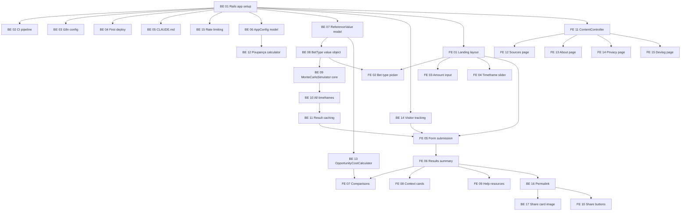

# You-Bet — Sprint Plan

**Duration**: 17 days | Jun 25 → Jul 12, 2026
**Approach**: TDD throughout — tests are written with features, not after.
**Assets**: Free/open-source only. No paid fonts, icons, images, or services.
**Track reality**: devlog (`/diario`). Compare planned vs actual at the end.

---

## Implementation Cards

Cards are vertical slices — each delivers a testable, functional piece. **BE** = backend, **FE** = frontend.

### Scaffold

| Card | Description | Test |
|---|---|---|
| **BE 01** | Rails app setup (Postgres, Hotwire, Propshaft, Tailwind), Docker (dev + staging), MIT LICENSE, README | — |
| **BE 02** | CI pipeline (GitHub Actions: tests + `bundler-audit`), `.env.example` | CI green on push |
| **BE 03** | i18n config (pt-BR primary, locale toggle scaffold) | — |
| **BE 04** | First Fly.io deploy (São Paulo `gru`), smoke test on production URL | HTTP 200 on prod |
| **BE 05** | Project CLAUDE.md | — |

---

### Data Infrastructure

Each card: model + migration + PaperTrail + `.get()` accessor + seeds + test.

| Card | Description | Test |
|---|---|---|
| **BE 06** | AppConfig model (PaperTrail, `data_source`, `.get()` with type casting). Seeds: `monte_carlo_sims`, `poupanca_monthly_rate`, `minimum_wage_cents`, `data_retention_days` | `.get()` returns correct type, PaperTrail tracks changes |
| **BE 07** | ReferenceValue model (PaperTrail, `data_source`, `category`, `.get()` accessor). Seeds: all comparison prices + all bet type house edges | `.get()` by category.key, seed idempotency |
| **BE 08** | BetType value object — reads house edge + variance from ReferenceValue, returns structured data per bet type | House edge values per type match seeds |

---

### Simulation Engine

Each card: service object + unit test. No controllers/views.

| Card | Description | Test |
|---|---|---|
| **BE 09** | MonteCarloSimulator core — takes bet types + weekly amount, runs 1K sims for a single timeframe, returns percentiles (P5/P25/P50/P75/P95) + profit percentage | Expected value within statistical bounds, percentiles ordered |
| **BE 10** | MonteCarloSimulator all timeframes — extend to 5 timeframes (4/26/52/104/260 weeks) in one pass | All 5 present, losses compound over longer periods |
| **BE 11** | Simulation result caching — cache key generation, SimulationResult storage, hit/miss behavior | Same inputs → hit, different → miss, results identical |
| **BE 12** | Poupança calculator — compound interest at BCB rate, returns balance per timeframe | Matches manual calculation for known inputs |
| **BE 13** | OpportunityCostCalculator — loads prices from ReferenceValue, filters by loss amount, picks 3 random + poupança fixed | Always includes poupança, items scale to loss |

---

### Anonymous Sessions

| Card | Description | Test |
|---|---|---|
| **BE 14** | VisitorIdentifiable concern — UUID cookie, signed permanent, Simulation model links to visitor_id | UUID persists across requests, records linked |

---

### Security

| Card | Description | Test |
|---|---|---|
| **BE 15** | Rack::Attack rate limiting — throttle simulation + general requests (ENV limits), fail2ban pattern in ENV | Throttle after limit, returns 429 |

---

### Permalink & Share Generation

| Card | Description | Test |
|---|---|---|
| **BE 16** | Shareable permalink — `/s/:uuid` route, OG meta tags (title, description, image) | OG tags in head, permalink resolves |
| **BE 17** | ShareCardGenerator — downloadable image with summary + #DesafioContraBets + Gatinho | Image generated, contains key data |

---

### Harden

| Card | Description | Test |
|---|---|---|
| **BE 18** | OWASP 2025 verification — walk top 10 checklist against the app | Checklist documented |
| **BE 19** | Edge case tests — zero amount, extreme values, all bet types combined, negative inputs | All handled gracefully |
| **BE 20** | Data verification — check every stat against primary source, pre-launch checklist | Checklist signed off |
| **BE 21** | Final deploy — Fly.io production + README polish (screenshots, local setup) | Smoke test on prod |

---

### Landing Page

Each card: view partial + Stimulus controller + integration test. Single-page form.

| Card | Description | Test |
|---|---|---|
| **FE 01** | Landing page layout — SimulationsController#new, header (☰ menu, YOU BET logo, Help), hero copy (WHAT/WHY), form area, site links, footer | Renders 200, contains form |
| **FE 02** | Bet type picker — carousel/slider, reads from BetType, Stimulus controller | All types rendered, at least one required |
| **FE 03** | Weekly amount input — radio buttons (DataSenado anchors) + custom field, Stimulus validation | Radios render, custom input validates |
| **FE 04** | Timeframe slider — predefined slots (1 mês, 6 meses, 1 ano, 2 anos, 5 anos), Stimulus controller | All 5 slots, default selected, value in form |
| **FE 05** | Form submission — SimulationsController#create, validates params, runs MonteCarloSimulator, creates Simulation, redirects to results | Valid → redirect, invalid → re-render with errors |

---

### Results Page

Each card: view partial + test. All under SimulationsController#show.

| Card | Description | Test |
|---|---|---|
| **FE 06** | Results summary card — bet type, weekly amount, total loss (R$), % loss from SimulationResult | Correct values rendered, 404 on invalid UUID |
| **FE 07** | Comparison items — OpportunityCostCalculator output, icon + count + name, "Show more" expandable | 3 items + poupança, expand loads more |
| **FE 08** | Context cards — data-backed stats with source citations (DataSenado, BCB, etc.) | Stats rendered with source attribution |
| **FE 09** | Help resources — CVV 188, SUS/CAPS, Jogadores Anônimos, autoexclusão. Always visible. | All resources rendered, links correct |
| **FE 10** | Share buttons — WhatsApp, Instagram, Twitter (link + image sharing) | Buttons render, URLs correct |

---

### Content Pages

Each card: controller (inherits ContentController) + view + route.

| Card | Description | Test |
|---|---|---|
| **FE 11** | ContentController base — shared layout/helpers for static pages | — |
| **FE 12** | Sources page — `/sources`, all 7 data sources with citations + methodological notes | All sources listed |
| **FE 13** | About page — `/about`, AI declaration, developer story, Gatinho, GitHub + devlog links | AI disclosure present |
| **FE 14** | Privacy page — `/privacy`, LGPD notice, data collected, retention, deletion | Deletion instructions present |
| **FE 15** | Devlog page — `/diario`, daily journal entries from markdown/YAML | Entries display chronologically |

---

### Polish

| Card | Description | Test |
|---|---|---|
| **FE 16** | Responsive design — mobile-first pass, Chrome Android + Safari iOS, touch inputs, card layouts | Visual QA on mobile viewports |
| **FE 17** | Visual polish — Gatinho branding, typography, color palette, textures | Visual QA |
| **FE 18** | Accessibility — semantic HTML, contrast, screen reader labels, keyboard nav, focus states | Lighthouse audit |

---

### Submit

| Card | Description |
|---|---|
| **SUB 01** | Record demo video/reel |
| **SUB 02** | Write submission caption + AI usage declaration |
| **SUB 03** | Publish on public profile + register via competition form |
| **SUB 04** | Final devlog entry + sanity check on live app |

---

## Card Count

| Area | Cards |
|---|---|
| Backend | BE 01–21 |
| Frontend | FE 01–18 |
| Submit | SUB 01–04 |
| **Total** | **43 cards** |

---

## Roadmap

| Card | Status | PR | Date |
|---|---|---|---|
| BE 01 | ✅ Done | #2 | Jun 28 |
| BE 02 | ⬜ | | |
| BE 03 | ⬜ | | |
| BE 04 | ⬜ | | |
| BE 05 | ⬜ | | |
| BE 06 | ⬜ | | |
| BE 07 | ⬜ | | |
| BE 08 | ⬜ | | |
| BE 09 | ⬜ | | |
| BE 10 | ⬜ | | |
| BE 11 | ⬜ | | |
| BE 12 | ⬜ | | |
| BE 13 | ⬜ | | |
| BE 14 | ⬜ | | |
| BE 15 | ⬜ | | |
| BE 16 | ⬜ | | |
| BE 17 | ⬜ | | |
| BE 18 | ⬜ | | |
| BE 19 | ⬜ | | |
| BE 20 | ⬜ | | |
| BE 21 | ⬜ | | |
| FE 01 | ⬜ | | |
| FE 02 | ⬜ | | |
| FE 03 | ⬜ | | |
| FE 04 | ⬜ | | |
| FE 05 | ⬜ | | |
| FE 06 | ⬜ | | |
| FE 07 | ⬜ | | |
| FE 08 | ⬜ | | |
| FE 09 | ⬜ | | |
| FE 10 | ⬜ | | |
| FE 11 | ⬜ | | |
| FE 12 | ⬜ | | |
| FE 13 | ⬜ | | |
| FE 14 | ⬜ | | |
| FE 15 | ⬜ | | |
| FE 16 | ⬜ | | |
| FE 17 | ⬜ | | |
| FE 18 | ⬜ | | |
| SUB 01 | ⬜ | | |
| SUB 02 | ⬜ | | |
| SUB 03 | ⬜ | | |
| SUB 04 | ⬜ | | |

---

## Dependency Graph

---

## Nice-to-Haves

If time allows or post-competition:

| Feature | Effort | Notes |
|---|---|---|
| **Analytics** (Plausible, Umami, or PostHog) | 0.5d | Privacy-focused. PostHog free tier: 1M events/mo. |
| **Data dashboard** — actual betting data vs aggregate simulation results | 1-2d | Validates our Monte Carlo against BCB/DataSenado figures. |
| Range fan visualization (P5→P95 chart) | 1d | Standalone component |
| EN translations | 0.5d | i18n scaffold ready |
| "Ver todas" expand button for comparisons | 0.25d | Trivial Turbo Frame |
| Data retention job | 0.25d | Cron task |
| "Compare bet types" mode | 2d | Feature expansion |
| User-facing modifier sliders | 1d | ReferenceValue infra ready |
| Dark mode | 0.5d | — |
| PWA | 0.5d | — |

---

## Open Questions

1. ~~CSS framework~~ → **Decided: Tailwind CSS**
2. ~~Chart library~~ → **Moved to nice-to-haves** (range fan is post-MVP)
3. ~~Image generation~~ → **Decided: HTML-to-image** (render HTML/CSS card, screenshot via headless browser)
4. **Domain**: `youbet.<domain>.com` — subdomain TBD, Gio buying domain
5. ~~Devlog format~~ → **Decided: YAML data file** rendered by a single view. Split file if it gets too long.
6. ~~Analytics~~ → **Decided: Umami** (free, self-hosted, lightweight, LGPD-friendly, no cost)

---

## Constraints

- **Free assets only** — no paid fonts, icons, images, libraries, or services. Google Fonts, Streamline Free, open-source everything.
- **Code in English only** — all code, comments, variable names, commit messages, and PR descriptions in English. Only i18n locale files contain Portuguese.
- **PR workflow** — one PR per card (or small group of related cards). Dense description, quick to read. Merge only after Gio's review.
- **TDD** — tests with features, not after.
- **i18n** — all user-facing strings in locale files from the start.
- **data_source** — every number in the app cites its origin.
- **Rails conventions + RuboCop** — follow Rails style guide, run RuboCop. Simple methods, short classes, no clever tricks.
- **No abbreviations** — never abbreviate variable names, method names, class names, or anything. `simulation_result`, not `sim_res`. `weekly_amount_cents`, not `wkly_amt`. Readability over keystrokes.
- **Seeds always current** — `db/seeds.rb` must always be up to date. Running `rails db:seed` on a fresh database should produce a working app.

---

## How to Use This Document

Track daily reality in the devlog (`/diario`). At the end of the sprint, compare this plan to what happened:
- Which cards took longer/shorter?
- What was added that wasn't planned?
- What was cut?
- What surprised us?
